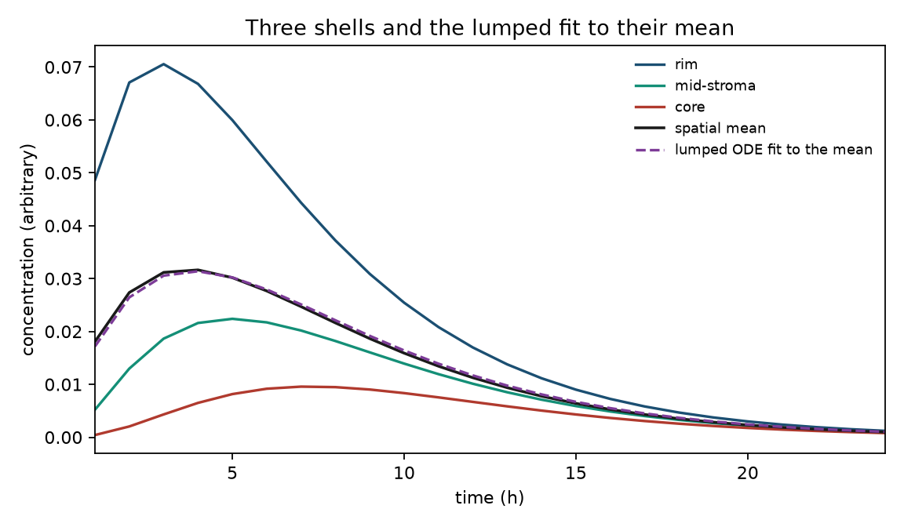
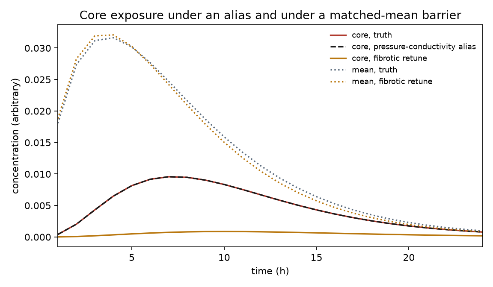
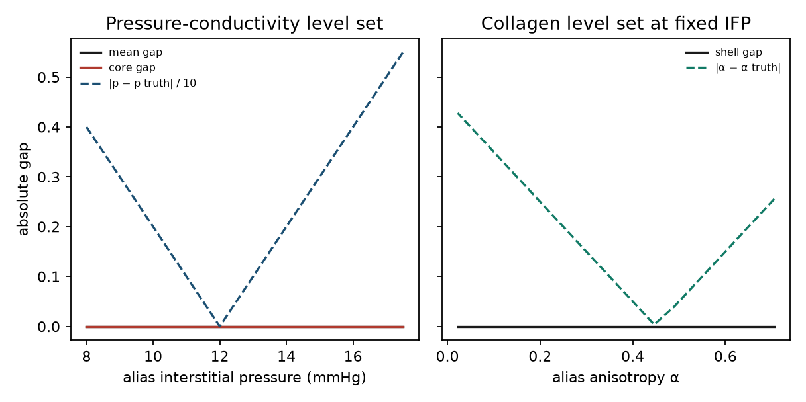
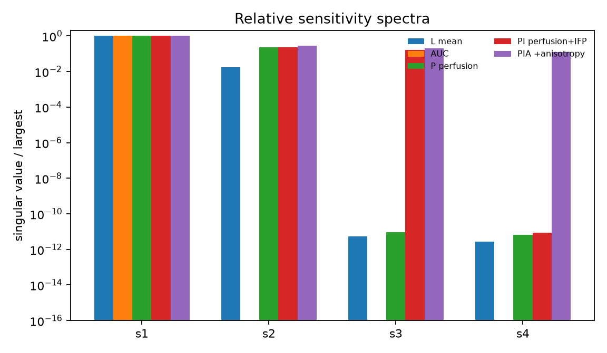

# Spatial Transport Identifiability in Desmoplastic Tumours: When a Lumped Burden ODE Cannot Represent a Fibrotic Delivery Barrier

**Thesis #11. Computational research thesis** (series label NP-02)  
**Author:** Kelechi Emeka Ogbonna  
**Correspondence:** kelechiogbonna300@gmail.com · https://github.com/cloudynirvana/thesis-11-desmoplastic-transport-identifiability  
**Date:** 21 September 2026  
**Format:** B.Sc. project chapters (Nile University style), written as a computational methods manuscript  
**Status:** In-silico identifiability on a declared three-shell transport surrogate. Not a perfusion fit. Not a clinical result.  
**Citation style:** numbered Vancouver. A `doi:` field appears only where Crossref returned the record.  
**DOI:** none for this document. Do not invent one.

---

## Title page

**SPATIAL TRANSPORT IDENTIFIABILITY IN DESMOPLASTIC TUMOURS: WHEN A LUMPED BURDEN ODE CANNOT REPRESENT A FIBROTIC DELIVERY BARRIER**

BY

**KELECHI EMEKA OGBONNA**

A COMPUTATIONAL RESEARCH THESIS  
(IN-SILICO IDENTIFIABILITY STUDY)

SUBMITTED AS A CITEABLE MANUSCRIPT FOR JOURNAL / THESIS HANDOFF

PROJECT CONFLUENCE  
INDEPENDENT COMPUTATIONAL RESEARCH

SUPERVISOR: not appointed for this deposit

SEPTEMBER 2026

---

## Declaration

I, Kelechi Emeka Ogbonna, declare that this computational research thesis was carried out by me. The shell trajectories, Fisher ranks, level-set gaps, and refits reported here were produced by `sim/transport_identifiability.py` at seed 20260921. They are not interstitial-pressure recordings, not second-harmonic generation images, and not area fractions from a resection. No DOI, ORCID, or journal acceptance was invented for this document.

_________________________     _______________________  
Kelechi Emeka Ogbonna         Date

---

## Abstract

For stroma-rich carcinomas, which observables (interstitial pressure, collagen anisotropy, perfusion maps) are required before a zero-dimensional burden ODE is even structurally capable of representing delivery failure, versus remaining an unidentified lumped sink?

The calculations use a three-shell radial reduction of a filtration-diffusion balance and a one-state burden equation. Four barrier coordinates are free: a hydraulic factor, a collagen volume fraction, a circumferential anisotropy, and an interstitial pressure. Plasma decay, clearance, and the two scale constants are known. The four coordinates enter the shells only as a filtration conductance and a radial coupling. Five observation schedules are declared. AUC is the time-integral of the spatial mean. L is that mean at 24 hourly times. P is the three shells at the same times. PI adds one pressure reading. PIA adds one anisotropy reading. Noise is Gaussian and independent, with declared standard deviations 0.008 (concentration), 1 mmHg (pressure), and 0.05 (anisotropy).

AUC has structural and practical rank 1 of 4. L has structural rank 2 and practical rank 1. The second principal relative standard error on L is 3.21, so the weaker conductance direction is present in the algebra and absent from any useful confidence statement at this noise. An exact pressure-conductivity alias, and an exact collagen alias at fixed pressure, reproduce every shell to a maximum absolute gap of 0. A noiseless least-squares fit of L, started at a distant barrier vector, stops at another point on that level set. The weighted cost is numerically zero. The same start, under PIA, returns the generating vector.

P raises practical rank from 1 to 2. That is the restoration asked for: the two conductances become a determined subset, and the four named coordinates do not. PI has rank 3. The remaining null direction mixes the hydraulic factor, the collagen fraction, and the anisotropy, with a pressure component at numerical zero. PIA has rank 4. Coordinate relative standard errors on PIA are 0.157, 0.154, 0.111, and 0.083. The last two match the direct measurement variances. The condition number of that relative Fisher matrix is 60.9.

Separately, the lumped equation can track the mean and still miss the core. At the truth, core over rim at 8 h is 0.255. The fitted lumped state at 8 h is 0.0221, against a core of 0.00947 and a rim of 0.0372. A fibrotic retune whose mean stays within root-mean-square error 6.01×10−4 of the truth drops the 8 h core from 0.00947 to 8.16×10−4.

The draws are synthetic. Chapter Four is not an imaging study. Research only. Not a medical device, not a dose, and not a cure.

---

## Keywords

structural identifiability; practical identifiability; Fisher information; interstitial fluid pressure; desmoplasia; collagen anisotropy; perfusion; compartment model; burden equation; synthetic surrogate; research only

---

## Table of Contents

DECLARATION  
ABSTRACT  
Table of Contents  
List of tables and figures  

CHAPTER ONE. INTRODUCTION  
1.1 Background to the study  
1.2 STATEMENT OF RESEARCH PROBLEM  
1.3 JUSTIFICATION OF STUDY  
1.4 AIM AND OBJECTIVES OF THE STUDY  
1.5 SIGNIFICANCE OF THE STUDY  
1.6 SCOPE OF THE STUDY  

CHAPTER TWO. LITERATURE REVIEW  
2.1 Interstitial transport and the pressure barrier  
2.2 Desmoplasia, aligned collagen, and the pancreatic stroma  
2.3 Continuum descriptions and the lumped burden equation  
2.4 Structural rank, profiles, and identifiable combinations  

CHAPTER THREE. MATERIALS AND METHODS  
3.1 Design  
3.2 Continuum balance and the three-shell reduction  
3.3 Parameters  
3.4 The lumped burden equation  
3.5 Observation schedules  
3.6 Fisher information and the two rank rules  
3.7 Level sets, refits, and multistart  
3.8 What was not done  

CHAPTER FOUR. RESULTS  
4.1 Shell trajectories and the lumped fit  
4.2 Exact level sets leave the barrier unnamed  
4.3 A matched mean with a starved core  
4.4 Ranks by schedule  
4.5 Noiseless refits and a noisy multistart  

CHAPTER FIVE. DISCUSSION, CONCLUSION AND RECOMMENDATION  
5.1 Discussion  
5.2 Conclusion  
5.3 Recommendation  

REFERENCES  
DISCLAIMER  

---

## List of tables and figures

**Table 3-1.** Generating barrier coordinates and known constants.  
**Table 3-2.** Observation schedules.  
**Table 4-1.** Concentrations at 8 h and lumped residuals.  
**Table 4-2.** Exact aliases and the matched-mean fibrotic retune.  
**Table 4-3.** Structural and practical ranks.  
**Table 4-4.** Noiseless refits from one distant start, and the noisy multistart window.

**Figure 4-1.** Rim, mid-stroma, core, spatial mean, and the lumped fit to the mean.  
**Figure 4-2.** Core trajectories for the truth, a pressure-conductivity alias, and the fibrotic retune.  
**Figure 4-3.** Output gaps along the two exact level sets.  
**Figure 4-4.** Relative singular-value spectra by schedule.

Figures are computational diagnostics from seed 20260921. They are not measured concentration fields.

---

# CHAPTER ONE

## 1.0 INTRODUCTION

For stroma-rich carcinomas, which observables (interstitial pressure, collagen anisotropy, perfusion maps) are required before a zero-dimensional burden ODE is even structurally capable of representing delivery failure, versus remaining an unidentified lumped sink?

### 1.1 Background to the study

Solid tumours impede the movement of solutes. Baxter and Jain wrote the interstitial problem as a convection-diffusion balance in which elevated interstitial pressure flattens the filtration gradient that would otherwise carry macromolecules out of leaky vessels [1]. Heldin, Rubin, Pietras, and Östman treated that pressure as a therapeutic obstacle in its own right: a uniformly high interstitial pressure removes the driving force for transvascular convection [2]. Jain's delivery review collects the same barriers under one heading: abnormal vessels, high pressure, and a matrix that slows diffusion [3].

Desmoplasia adds a second, mechanical layer. Growth-induced solid stress compresses vessels in murine and human tumours [4]. In pancreatic ductal adenocarcinoma the point was made in animals before it was a modelling slogan. Olive and colleagues showed that hedgehog-pathway inhibition, in a mouse model, changed stromal architecture and increased delivery of gemcitabine [5]. Provenzano and colleagues showed that enzymatic digestion of hyaluronan lowered interstitial pressure and improved delivery in a separate pancreatic model [6]. Those papers are experiments. They do not supply the rate constants of this thesis. They supply the reason a barrier is more than a single clearance number.

Drug penetration across a tumour cord is already known to be uneven when the matrix and the cell layers are intact [7]. A zero-dimensional equation can still be the right summary if the only scientific target is a whole-tumour amount. It is the wrong summary when the scientific target is the barrier that produced the amount. Identifiability theory separates those two targets. Bellman and Åström defined structural identifiability as uniqueness of the internal parameter in the input-output map, noise aside, and they did so with compartment models in view [8]. Raue and colleagues turned the practical half of the question into a profile: a coordinate is practically determined when the likelihood, with every other free parameter refitted, eventually rises [9]. Cobelli and DiStefano had already warned that a parameter can be structurally present and still be ambiguous once the output map is finite [10]. Chis, Banga, and Balsa-Canto compared the structural tests that later software implements, and recorded how often the tests disagree on biological models [11].

The object in this thesis is the output map of a fibrotic delivery barrier. The object is the adequacy of a lumped burden equation for that barrier. Metabolic calibration, tipping coordinates, immune parameters, and graph models of spread are different objects. They are not analysed here.

### 1.2 STATEMENT OF RESEARCH PROBLEM

For stroma-rich carcinomas, which observables (interstitial pressure, collagen anisotropy, perfusion maps) are required before a zero-dimensional burden ODE is even structurally capable of representing delivery failure, versus remaining an unidentified lumped sink?

The working form is narrow. Four barrier coordinates are free. Two conductances carry them into a three-shell equation. One schedule sees a single integral of the mean amount. One sees the mean trajectory. One sees the three shells. Two further schedules add a pressure scalar, then an anisotropy scalar. Failure, if it occurs, is read from the rank of this family and from level sets on which the lumped output does not move. It is a statement about these equations [8,10].

A familiar way to miss the question is to freeze three coordinates, move the fourth, watch the mean change, and call the fourth identified. That path is a slice. A second miss is to treat a rise in rank as a naming of every printed coordinate. Rank 2 in four dimensions still leaves a surface of equally good barriers [8,9]. A third miss is to judge the lumped equation only by its fit to the mean. A one-state equation can fit a mean and still have no variable in which a starved core could appear.

### 1.3 JUSTIFICATION OF STUDY

Interstitial transport models are often reduced before they are fitted. The reduction is reasonable when the datum is a plasma curve plus a whole-tumour residue. It is a strong claim when the fitted coefficient is then described as hydraulic conductivity, or as collagen content, or as pressure. Those words name different physical quantities. They coincide in a model only when the output can tell them apart.

The literature already contains the pieces of that warning in separate places. Structural identifiability is a property of the input-output map [8]. Practical identifiability is a property of the likelihood on a finite, noisy sample [9,10]. Tumour interstitial pressure, solid stress, and matrix composition are different measurements [1,2,4]. Nothing in that separation, by itself, says what a three-shell reduction does under a mean trajectory. The study is that calculation.

There is a second justification inside the model class. If the vector field depends on the barrier only through two conductances, then every concentration schedule, however finely sampled in space, has a sensitivity of rank at most two. That ceiling is a chain-rule fact. It does not require a Monte Carlo study to state, and it does require a numerical check to confirm that the two conductances are actually visible. Chapter Three writes the fact. Chapter Four checks it.

### 1.4 AIM AND OBJECTIVES OF THE STUDY

The aim is to determine which of the declared schedules make the four barrier coordinates of Section 3.3 structurally and practically identifiable, and to record where a one-state burden equation ceases to represent spatial delivery failure.

The objectives are:

1. Reduce a filtration-diffusion balance to three equal shells and write the two conductances that carry the barrier coordinates.
2. Fit a one-state burden equation to the spatial mean and compare that state with the core and the rim.
3. Compute Fisher ranks for the integral, the mean trajectory, the three-shell map, and the same map with pressure and with anisotropy.
4. Exhibit exact level sets on which every shell is unchanged while the named coordinates move, and repeat the demonstration with a noiseless refit.
5. Keep the surrogate label on every numerical claim, and keep dosing and device claims outside the aim.

Non-aims. Estimating a hydraulic conductivity for a named carcinoma. Choosing a stromal drug. Converting a rank into an imaging protocol. Editing the conductances until the null space disappears and then reporting the edited model as if it were the original.

### 1.5 SIGNIFICANCE OF THE STUDY

The useful product is a split between two failures that a calibration paragraph often merges. The first failure is representational. A one-state equation has no core. A core-to-rim ratio is not among its outputs, so a delivery failure that lives in that ratio is not a trajectory of the equation. The second failure is identifiability. Even the three-shell equation, read through concentrations alone, determines conductances, and conductances are composites. Naming the composites as if they were the four coordinates overstates what the output contains [8,10].

The schedules then form a ladder, local to Section 3.2. The integral determines one combination. The mean trajectory adds a second combination that, at the declared noise, is too flat to use. The shells make that second combination usable. Pressure adds a third direction. Anisotropy adds a fourth. A later worker can recount the singular values from `sim/results.json` without adopting a clinical sentence.

### 1.6 SCOPE OF THE STUDY

In scope. The three-shell reduction. A known plasma exponential. A known clearance. Four barrier coordinates. The five schedules in Table 3-2. Gaussian Fisher information at the generating point. Exact level sets of the two conductances. One noiseless refit of the mean and of the full schedule. One noisy multistart, used as a dispersion check. One fibrotic retune whose mean is matched and whose core is not.

Out of scope. Patient images. A spherical mesh with measured millimetre geometry. Lymphatic drainage as its own state. Binding, cellular uptake, and a proliferating cell count. A global differential-algebra certificate. Any map from these coordinates to a dose.

These ranks describe the compartment reduction and the schedules in Chapter Three. The hydraulic factor is a positive multiplier inside a declared conductance. The collagen fraction and the anisotropy are coordinates of that conductance, and they are not area fractions read from a slide. Interstitial pressure is a scalar in the same formula, and it is not a needle measurement. The rank table is not a dose, not a device output, and not a reason to image or to withhold imaging.

---

# CHAPTER TWO

## 2.0 LITERATURE REVIEW

### 2.1 Interstitial transport and the pressure barrier

Starling's 1896 account of fluid exchange already isolates the quantities a later tumour model has to lump or to keep: microvascular pressure, interstitial pressure, and the permeability of the wall [12]. Kedem and Katchalsky put the solute flux on a thermodynamic footing, with a reflection coefficient sitting between pure convection and pure diffusion [13]. Michel and Curry reviewed the microvascular permeability that those coefficients summarise [14]. Levick and Michel restated the Starling balance with the glycocalyx in view, which matters here only as a reminder that a single filtration coefficient is already a composite in healthy tissue [15].

Baxter and Jain carried that balance into a tumour interstitium. The first paper places interstitial pressure and convection at the centre of macromolecular transport [1]. The second adds heterogeneous perfusion and lymphatics, so that a spatially uniform clearance is already an idealisation inside their own series [16]. The experimental pressure literature lines up with the first paper more than with a well-mixed compartment. Heldin and colleagues reviewed high interstitial pressure as an obstacle to therapy [2]. Measurements in human tumours, which that review surveys, are not repeated here and are not used as numbers in Chapter Four.

Nanomedicine reviews inherited the same map. Jain and Stylianopoulos list abnormal vasculature, elevated pressure, and dense matrix as the reasons a nanoparticle can fail after it has left the bloodstream [17]. Chauhan, Stylianopoulos, Boucher, and Jain organise the barriers by length scale, from vessel wall to interstitial path [18]. Jain, Martin, and Stylianopoulos then place mechanical forces, solid stress as well as fluid pressure, inside tumour growth and therapy [19]. Nia, Munn, and Jain later gather those forces under the heading of physical traits [20]. The trait list is a classification. It is not a parameter vector, and this thesis does not fit it.

Two mechanical facts keep pressure from being a synonym for matrix content. Chauhan and colleagues reported that hyaluronan compresses pancreatic tumour vessels through solid stress, and that interstitial fluid pressure is not the compressive agent in that account [21]. Stylianopoulos and colleagues followed solid stress and interstitial pressure as coevolving fields during tumour progression, with vascular collapse as one consequence [22]. A model that offers only one delivery coefficient cannot host that distinction. The coefficient can still be a correct summary of net amount. It cannot be a correct name for both fields.

Pharmacological attempts to change the barrier have used the same split. Angiotensin inhibition, in the work of Chauhan and colleagues, improved delivery in association with decompression of tumour vessels [23]. Losartan, in the study of Diop-Frimpong and colleagues, reduced collagen I synthesis and altered the distribution of nanotherapeutics [24]. Stylianopoulos and Jain examined the combination of two stromal strategies in a mathematical and experimental frame [25]. A later review treats reengineering of the physical microenvironment as a programme that joins models to those experiments [26]. None of those studies identifies the four coordinates of Section 3.3. They are cited so that the coordinates have a literature, not so that the ranks can be read as drug effects.

### 2.2 Desmoplasia, aligned collagen, and the pancreatic stroma

Pancreatic ductal adenocarcinoma is the stroma-rich case this thesis has in mind, and it is a case rather than a dataset. Jacobetz and colleagues showed that hyaluronan impairs vascular function and drug delivery in a mouse model [27]. Whatcott and colleagues documented desmoplasia in primary tumours and in metastases, which blocks any assumption that the stromal barrier is only a primary-tumour curiosity [28]. Neesse and colleagues reviewed stromal biology as a therapeutic problem in 2011 and returned to it in 2015 as the paradigm shifted [29,30]. Erkan and colleagues set out diagnostic and therapeutic implications of the stroma [31]. Hosein, Brekken, and Maitra updated the targeting strategies a decade after the first wave of stromal depletion experiments [32]. Feig and colleagues described the cellular composition of the pancreas cancer microenvironment that those strategies have to meet [33].

The depletion experiments also cut against a simple story in which less stroma is always more delivery. Provenzano and Hingorani reviewed hyaluronan, fluid pressure, and stromal resistance together, including the possibility that the matrix is both a barrier and a restraint [34]. DuFort, DelGiorno, and Hingorani described the fluid, solid, and cellular pressures that sit on a pancreatic ductal adenocarcinoma at once [35]. A companion biophysical paper argued that the interstitial pressure in that disease is dominated by a gel-fluid phase, which is a different mechanism from a purely hydraulic Starling drop [36]. Rhim and colleagues reported that stromal elements can restrain, as well as fail to support, the carcinoma [37]. Özdemir and colleagues reported that depletion of carcinoma-associated fibroblasts and fibrosis can accelerate the disease and impair immune control [38]. Voutouri and colleagues modelled hyaluronan-derived swelling and the separate contribution of collagen [39]. The present equations contain none of that biology as a state. They contain a collagen fraction and an anisotropy because those are the matrix coordinates a transport reduction is tempted to hide inside one rate.

Collagen orientation is measurable, and it is not the same measurement as a volume fraction. Provenzano and colleagues, using second-harmonic generation, described collagen reorganisation at the tumour-stromal interface as a feature that accompanies local invasion [40]. Conklin and colleagues reported aligned collagen as a prognostic signature in human breast carcinoma [41]. Brown and colleagues showed that second-harmonic generation can follow collagen, and its modulation, in tumours in vivo [42]. In pancreatic ductal adenocarcinoma, Drifka and colleagues reported that highly aligned stromal collagen after resection is a negative prognostic factor [43]. Laklai and colleagues connected genotype to tissue tension and matricellular fibrosis in the same disease [44]. Öhlund and colleagues separated inflammatory fibroblasts from myofibroblasts in pancreatic cancer, which is a cellular distinction sitting underneath any single anisotropy index [45]. Schedule PIA in this thesis treats anisotropy as one scalar with a declared noise. It does not invert a second-harmonic image.

### 2.3 Continuum descriptions and the lumped burden equation

Once the barriers are granted, the modelling choice is which fields to keep. Swartz and Fleury reviewed interstitial flow in soft tissues as a transport process with its own length scales [46]. Dewhirst and Secomb traced the path from blood vessel to tumour tissue and the physical steps at which a drug is lost [47]. Tredan, Galmarini, Patel, and Tannock placed drug resistance against the solid-tumour microenvironment, including the penetration problem [48]. Minchinton and Tannock had already reviewed penetration as a spatial fact: cells far from a vessel see less drug [7]. A burden equation that tracks one amount can reproduce a falling plasma curve and a rising residue. It cannot reproduce a gradient it does not possess.

Computational papers have kept the gradient in different ways. Welter and Rieger solved interstitial flow and delivery on a vascularised tumour geometry [49]. Soltani and Chen solved a fluid-flow problem in solid tumours numerically [50]. d'Esposito and colleagues coupled computational fluid dynamics to cleared-tissue imaging and to in vivo perfusion, and compared predicted uptake with treatment response in that experimental frame [51]. Thurber and Weissleder argued for a systems reading of tumour pharmacokinetics in which the measurable curves constrain a compact model [52]. Schmidt and Wittrup analysed how molecular size and binding affinity change targeting, which is a reminder that this thesis fixes size and omits binding [53]. Stapleton and colleagues related microcirculation, interstitial pressure, and liposome accumulation inside tumours, an empirical trio close to the observables named in the problem statement [54].

The reduction used here sits below those geometries. It keeps three radial shells and two conductances. It is a compartment reading of the Baxter-Jain balance [1,16], small enough that the rank can be derived by hand and then checked by singular values. It is not a claim that three shells approximate a named tumour diameter.

The lumped alternative is the equation a burden model writes when spatial structure has already been discarded: one state, one delivery coefficient, one clearance. Clearance is treated as known in this study so that the unidentified object is the barrier, not a generic excess of rates. The delivery coefficient is then the sink, or the source, into which hydraulic conductivity, collagen, anisotropy, and pressure are poured. Chapter Four asks what that pouring costs.

### 2.4 Structural rank, profiles, and identifiable combinations

Bellman and Åström's definition is global in spirit and local in many later calculations: the parameter is identifiable when the input-output map determines it [8]. Ljung and Glad gave a rank test for global identifiability of rational models [55]. Villaverde, Barreiro, and Papachristodoulou survey how often systems biology replaces that ideal with a local numerical test [56]. Miao, Xia, Perelson, and Wu develop the nonlinear ODE case with viral dynamics as the worked example, and they are explicit that the output map, not the richness of the differential equation, decides the question [57]. This thesis is in the local group. A zero singular value at one parameter point is evidence of a local null direction. It is not, by itself, a classification of every equivalent point in the positive orthant [55,56].

Sloppiness is a statement about a spread of singular values, including values that are not zero. Gutenkunst and colleagues found spectra in which each successive eigenvalue drops by a large factor in models that had been regarded as fitted [58]. Transtrum, Machta, and Sethna describe the geometry behind that pattern: the chi-square surface is thin in some directions and long in others [59]. Wieland and colleagues separate the structural question from the practical one in a short review that matches the two rank rules of Section 3.6 [60]. A direction can be structurally present and still too flat for the noise one actually has. Chapter Four contains one such direction, on the mean trajectory, and states the singular values so that a reader can move the cutoff.

When the rank is deficient, the honest report is a combination, not a coordinate. Eisenberg and Hayashi show how subset profiling finds identifiable combinations [61]. Kreutz, Raue, Kaschek, and Timmer set out the profile likelihood as the tool that refits the remaining parameters instead of freezing them [62]. Jacquez and Greif pressed the same distinction into sampling design: estimability depends on the grid, not only on the differential equation [63]. Raue, Karlsson, Saccomani, Jirstrand, and Timmer compared structural and practical procedures on biological systems and recorded the cases in which a structural pass still leaves a flat profile [64]. Joubert, Stigter, and Molenaar ask a question close to this thesis from the other side: which minimal output set restores structural identifiability [65]. Hong, Ovchinnikov, Pogudin, and Yap provide software for a structural test on ODE models [66]. The test in Chapter Three is the analytic rank of the conductance map, confirmed by the numerical rank of the sensitivity. A software certificate of the global ideal is listed under what was not done.

---

# CHAPTER THREE

## 3.0 MATERIALS AND METHODS

### 3.1 Design

The study is a forward calculation on a declared generator. One parameter vector produces shell trajectories. Schedules are applied to those trajectories. Ranks are properties of the schedules at that vector. Aliases are constructed so that the two conductances stay fixed while the named coordinates move. A lumped equation is fitted to the mean and scored against the core. A second barrier is retuned to the mean and scored against the core as well.

The random seed is 20260921. The Fisher calculation at the generating point is deterministic. The seed governs the noisy multistart in Section 3.7. No measurement file is read.

### 3.2 Continuum balance and the three-shell reduction

Let c(x, t) be a dimensionless interstitial concentration along a radial line from a perivascular rim toward a core. The balance kept from the classical interstitial description is a radial diffusive flux, a clearance, and a filtration influx at the rim [1,13]:

∂c/∂t = ∂/∂x ( Drad ∂c/∂x ) − kout c,

with a rim boundary flux proportional to the drop between plasma and the rim concentration, the proportionality being a filtration conductance. Lymphatic drainage, Starling reflection, and binding are omitted. Their omission is a modelling choice, recorded in Section 3.8, and it is what makes the rank a property of two conductances rather than of a longer parameter list.

Three equal finite volumes, with the unknown length absorbed into the coupling, give the shells used throughout. Write Cr, Cm, and Cc for rim, mid-stroma, and core. Let F be the filtration conductance into the rim and G the radial coupling between neighbours. Plasma concentration is the known input Cp(t) = exp(−t / τ). The shells are

dCr/dt = F (Cp − Cr) + G (Cm − Cr) − kout Cr,

dCm/dt = G (Cr − 2 Cm + Cc) − kout Cm,

dCc/dt = G (Cm − Cc) − kout Cc.

Initial concentrations are zero. Equal volumes are a declaration, so concentration and amount share the same balance. They are not a spherical integral.

The barrier coordinates are collected as θ = (κ, φ, α, p). Here κ is a positive hydraulic factor, φ is a collagen volume fraction in (0, 1), α is a circumferential anisotropy in [0, 1), and p is interstitial pressure in mmHg. Microvascular pressure Pv is known. The conductances are

F = sF κ (Pv − p) (1 − φ),

G = sG (1 − φ)2 (1 − α).

The scales sF and sG are known constants. They set units. They are not estimated. The map ψ = (F, G) = h(θ) is the only route by which θ enters the differential equation. The analytic derivative H = ∂ψ/∂θ is 2 × 4. At any interior point with F and G positive its rank is 2. Two independent local null vectors are available in closed form. One trades κ against p at fixed φ and α, because F depends on the product κ (Pv − p). The other trades φ against κ and α at fixed p, because the pair (κ (1 − φ), (1 − φ)2 (1 − α)) is two constraints on three numbers.

Any observation that is a function of the concentration trajectory therefore has parameter sensitivity of rank at most 2. The argument is the chain rule: ∂y/∂θ = (∂y/∂ψ) (∂ψ/∂θ). Adding a direct reading of p appends a row that isolates p, because the concentration sensitivities cannot see p separately from κ. Adding a direct reading of α appends a row that isolates α. With both appended, φ is recoverable from G and κ is recoverable from F. That is the structural ladder. Chapter Four asks whether the numerical singular values respect it, and whether the two visible directions are both usable under the declared noise.

### 3.3 Parameters

Table 3-1 lists the generating vector and the constants held fixed. The vector is a stroma-rich setting in the sense of the model: collagen fraction 0.40, anisotropy 0.45, interstitial pressure 12 mmHg against a microvascular pressure of 20 mmHg. It is not a fit to a tumour.

Integration uses a stiff solver (BDF) from 0 to 24 h, with relative tolerance 10−8 and absolute tolerance 10−10. Observations are taken at t = 1, 2, ..., 24 h. At the truth the conductances are F = 0.072 h−1 and G = 0.2376 h−1. The analytic Jacobian of h at this point has rank 2, and both closed-form null vectors lie in its kernel to a residual of 0.

**Table 3-1.** Generating barrier coordinates and known constants.

| Symbol | Role | Value |
| --- | --- | --- |
| κ | Hydraulic factor | 1 |
| φ | Collagen volume fraction | 0.40 |
| α | Circumferential anisotropy | 0.45 |
| p | Interstitial pressure | 12 mmHg |
| Pv | Microvascular pressure (known) | 20 mmHg |
| τ | Plasma decay (known) | 4 h |
| kout | Clearance (known) | 0.25 h−1 |
| sF | Filtration scale (known) | 0.015 h−1 mmHg−1 |
| sG | Radial scale (known) | 1.20 h−1 |

### 3.4 The lumped burden equation

The lumped model has one state C(t), called the burden because it is the well-mixed interstitial amount. It is not a proliferating cell count. The equation is

dC/dt = kdel (Cp − C) − kout C,

with C(0) = 0. The only free parameter is kdel &gt; 0. It is fitted by least squares to the spatial mean of the three shells. Root-mean-square error is then computed against that mean, against the rim, and against the core. A one-state equation that has matched the mean will still be scored as having missed the core when those two errors separate.

A cell-count equation driven only by this single amount would inherit the same blindness. It would see the barrier through C(t), and C(t) is constant on the level set of (F, G). That extension is not simulated. The structural remark is enough, and it is labelled as a remark.

### 3.5 Observation schedules

Table 3-2 names the schedules. Concentration noise is independent and Gaussian with standard deviation σc = 0.008. At the truth this is about 11% of the peak rim concentration. Pressure, when it is observed, is one scalar equal to p, with standard deviation 1 mmHg. Anisotropy, when it is observed, is one scalar equal to α, with standard deviation 0.05. Neither stromal scalar is repeated across time. Repeating a direct reading would shrink a variance. It would not add a new structural direction.

The AUC noise is the trapezoidal propagation of σc through the hourly weights, used only to scale the single singular value. Rank of a one-dimensional output cannot exceed 1 for any positive scale.

**Table 3-2.** Observation schedules.

| Code | What is recorded | Count |
| --- | --- | --- |
| AUC | Time-integral of the spatial mean | 1 |
| L | Spatial mean at 24 times | 24 |
| P | Rim, mid-stroma, and core at 24 times | 72 |
| I | Interstitial pressure alone | 1 |
| PI | Schedule P plus one pressure reading | 73 |
| PIA | Schedule PI plus one anisotropy reading | 74 |

### 3.6 Fisher information and the two rank rules

Sensitivities are central differences. The step on coordinate j is 10−5 times the larger of |θj| and 1. Halving the step changes the retained singular values of schedule P, those above 10−6, by a maximum relative gap of 4.99×10−11. The numerical floor, near 10−10, moves when the step moves. It is not used as a scientific direction.

Columns are then scaled by θj and by the observation standard deviation, so that a singular value refers to a relative parameter shift under the declared noise. Write s1 ≥ s2 ≥ s3 ≥ s4 for those singular values. The structural rank is the number of singular values above 10−8 s1. The practical rank is the number of principal-axis relative standard errors below one half, where that standard error is 1/sk for each structurally nonzero value. The cutoff is the rule in the script that writes Table 4-3. The singular values are stored, so a different cutoff can be applied without resolving the ODE. In the event, every discarded principal error on these schedules is at least 3.21, and every retained one is at most 0.202. Any cutoff between those two numbers leaves the practical column unchanged.

For the full-rank schedule only, the relative Fisher matrix is inverted. Its diagonal square roots are coordinate-wise Cramér-Rao sketches. They are sketches at one point under the Gaussian model. They are not confidence intervals from a sampling distribution [9,62].

### 3.7 Level sets, refits, and multistart

Two exact aliases are built from the closed form of h. The pressure alias raises p from 12 to 16 mmHg and sets κ = 2, which holds κ (Pv − p) at its generating value. The collagen alias sets φ = 0.22 and adjusts κ and α so that both F and G match the truth, with p held at 12 mmHg. Shell gaps are the maximum absolute difference over the three shells and the 24 times.

A path of pressure aliases, and a path of collagen aliases, are integrated only to confirm that the gap stays at solver noise along each path. Figure 4-3 plots those gaps.

The fibrotic retune is a different comparison. Collagen fraction and anisotropy are set to 0.58 and 0.82, pressure is left at 12 mmHg, and κ is chosen by least squares so that the spatial mean matches the truth mean. This point is not on the level set. It is the case in which a lumped observer, seeing only the mean, is offered two barriers.

Noiseless refits start at (κ, φ, α, p) = (2.4, 0.25, 0.72, 16.5), inside the bounds κ ∈ [0.15, 4], φ ∈ [0.08, 0.72], α ∈ [0.05, 0.90], p ∈ [4, 18]. The target is the noise-free output of L, and then of PIA. Success for PIA means a return to the generating vector. Success for L, in the sense of the scientific question, means a low cost at a distant vector.

The noisy multistart draws one observation from the declared noise and starts least squares from the truth and from 19 further uniform draws for L (16 starts in total for PIA, including the truth). A fit is retained when its weighted sum of squares lies within 3.84 of the best cost in that draw. The window is the 95% point of a chi-square law with one degree of freedom. It is a window, not a profile [9]. Dispersion among retained fits is the practical companion of the singular values.

### 3.8 What was not done

No global identifiability certificate was computed [55,66]. No profile likelihood was traced on a grid of refits, because the exact level sets already give the flat directions in closed form, and a profile along a known flat direction is flat by construction [62]. Binding, lymphatics, and a cell-count state were not added. Shell volumes were not taken from a geometry. The noise is independent across shells, which understates the correlation a real imaging voxel would carry. One noisy draw is not a sampling distribution of the estimator. The study does not select a dose, a device threshold, or an imaging protocol.

---

# CHAPTER FOUR

## 4.0 RESULTS

### 4.1 Shell trajectories and the lumped fit

The truth produces a rim-high field. Peak rim concentration is 0.0705. Peak core concentration is 0.00957. Peak mean is 0.0316. At 8 h the rim is 0.0372, the mid-stroma is 0.0182, the core is 0.00947, and the mean is 0.0216. The core-to-rim ratio at that hour is 0.255. Figure 4-1 shows the three shells, the mean, and the lumped trajectory fitted to the mean.

The fitted delivery coefficient is kdel = 0.0223 h−1. Root-mean-square error against the mean is 4.10×10−4. Root-mean-square error against the core is 1.24×10−2. Root-mean-square error against the rim is 1.81×10−2. At 8 h the lumped state is 0.0221, close to the mean and far from both the rim and the core. Table 4-1 collects these values. The one-state equation has represented the burden it was fitted to. It has not represented the spatial delivery failure already present in the generator, a core that holds about a quarter of the rim concentration [7,47].

**Table 4-1.** Concentrations at 8 h and lumped residuals.

| Quantity | Value |
| --- | --- |
| Rim at 8 h | 0.0372 |
| Mid-stroma at 8 h | 0.0182 |
| Core at 8 h | 0.00947 |
| Mean at 8 h | 0.0216 |
| Core / rim at 8 h | 0.255 |
| Lumped state at 8 h | 0.0221 |
| kdel | 0.0223 h−1 |
| Lumped RMSE against the mean | 4.10×10−4 |
| Lumped RMSE against the core | 1.24×10−2 |
| Lumped RMSE against the rim | 1.81×10−2 |

### 4.2 Exact level sets leave the barrier unnamed

The pressure alias (κ, φ, α, p) = (2, 0.40, 0.45, 16) has the same conductances as the truth, F = 0.072 h−1 and G = 0.2376 h−1. The maximum absolute shell gap on the 24-point grid is 0. The collagen alias (0.769, 0.22, 0.675, 12) has the same conductances and the same gap of 0. Table 4-2 lists both. Figure 4-2 overlays the core of the pressure alias on the core of the truth. The curves coincide.

Along a path of pressure aliases from 8 to 17.5 mmHg, with κ adjusted to hold the product κ (Pv − p), the maximum absolute gap in the mean and the maximum absolute gap in the core remain at solver noise. The plotted pressure gap in Figure 4-3 is the absolute pressure error divided by 10, drawn so that a real change in the coordinate is visible on the same axes as a null change in the output. Along a path of collagen aliases with φ from 0.18 to 0.55, the shell gap remains at solver noise while α moves. Concentration data, lumped or spatial, do not name the barrier. They name the conductances, and only when those conductances are separately visible [8,61].

The integral is the stark lumped case. One number has structural rank 1 (Table 4-3). Its null space includes a direction that is essentially pure anisotropy: the corresponding right-singular vector is approximately (0.019, −0.005, 1, −0.010) in the relative coordinates. A circumferential alignment can change, inside the compensating level set, and the time-integral of the mean need not move.

### 4.3 A matched mean with a starved core

The fibrotic retune uses (κ, φ, α, p) = (1.492, 0.58, 0.82, 12). Its conductances are F = 0.0752 h−1 and G = 0.0381 h−1. Radial coupling has fallen by a factor of about six relative to the truth, while filtration has been held near the generating value by the rise in κ. Root-mean-square error of the mean against the truth mean is 6.01×10−4. At 8 h the means are 0.0216 and 0.0209. The cores at 8 h are 0.00947 and 8.16×10−4. Root-mean-square error of the core trajectories is 5.12×10−3.

A lumped observer who sees the mean, and who accepts an error on the order of 6×10−4, is looking at two barriers. One of them supplies a core concentration an order of magnitude lower at 8 h. The lumped state fitted in Section 4.1 cannot record that difference, because it has nowhere to put it. This is the representational failure, and it is distinct from the level-set failure of Section 4.2. The level set says that several barriers share one output. The retune says that two barriers can share a mean while their cores diverge, so the mean was the wrong output for the question [7,54].

**Table 4-2.** Exact aliases and the matched-mean fibrotic retune.

| Case | κ | φ | α | p (mmHg) | F (h−1) | G (h−1) | Shell or core comparison |
| --- | --- | --- | --- | --- | --- | --- | --- |
| Truth | 1 | 0.40 | 0.45 | 12 | 0.072 | 0.2376 | Generating field |
| Pressure alias | 2 | 0.40 | 0.45 | 16 | 0.072 | 0.2376 | Max abs shell gap 0 |
| Collagen alias | 0.769 | 0.22 | 0.675 | 12 | 0.072 | 0.2376 | Max abs shell gap 0 |
| Fibrotic retune | 1.492 | 0.58 | 0.82 | 12 | 0.0752 | 0.0381 | Mean RMSE 6.01×10−4; core at 8 h is 8.16×10−4 |

### 4.4 Ranks by schedule

Table 4-3 and Figure 4-4 give the ranks. AUC has structural rank 1 and practical rank 1, with principal relative standard error 0.0747. One combination of the four coordinates is determined. The other three directions are structural zeros. L, the mean trajectory, has structural rank 2 and practical rank 1. The leading relative standard error is 0.0567. The second is 3.21, from a singular-value ratio of 0.0176. The direction is real, and it is not a usable estimate at σc = 0.008. The two remaining singular values sit at the numerical floor.

P, the three shells, has structural rank 2 and practical rank 2. Principal relative standard errors are 0.0268 and 0.120. The second ratio is 0.223. Perfusion does not break the chain-rule ceiling, and it does make the second conductance direction usable. That is the schedule that restores rank for a subset: the subset is the pair (F, G), two combinations, while κ, φ, α, and p remain non-unique. The null vectors of P are mixtures of all four relative coordinates, consistent with a two-dimensional kernel of h [61,65].

Pressure alone has rank 1, as a direct reading of one coordinate must. PI has structural and practical rank 3. Principal relative standard errors are 0.0259, 0.114, and 0.158. The null vector is approximately (0.329, 0.494, −0.805, 0) in relative coordinates. The pressure component is numerical zero. The unidentified direction that remains is a trade among κ, φ, and α. Perfusion plus pressure therefore names p and the two conductances, and it does not name the collagen fraction separately from the hydraulic factor and the anisotropy.

PIA has structural and practical rank 4. Principal relative standard errors are 0.0259, 0.0926, 0.132, and 0.202. The smallest singular-value ratio is 0.128. The relative Fisher matrix has condition number 60.9. Coordinate-wise relative Cramér-Rao sketches are 0.157 for κ, 0.154 for φ, 0.111 for α, and 0.0833 for p. The anisotropy figure equals 0.05 / 0.45, and the pressure figure equals 1 / 12. Those two margins are the direct measurements. The shell series is what then separates κ from φ, once α and p are seen, at relative sketches near 0.16. Full rank here means the four coordinates are locally determined. It does not mean each of them was determined by the shells alone [10,60].

No reduction of σc creates a third structural direction from concentration data. The third and fourth singular values of L and of P are numerical zeros. A smaller noise would shrink the practical error on the second mean direction, and it would leave the kernel of h in place. The split between a flat-but-present direction and a structural zero is the reason Table 4-3 reports both ranks [58,60].

**Table 4-3.** Structural and practical ranks. Practical rank counts principal relative standard errors below 1/2.

| Schedule | Observations | Structural rank | Practical rank | Principal relative SE |
| --- | --- | --- | --- | --- |
| AUC | 1 | 1 | 1 | 0.0747 |
| L, mean trajectory | 24 | 2 | 1 | 0.0567, 3.21 |
| P, three shells | 72 | 2 | 2 | 0.0268, 0.120 |
| I, pressure alone | 1 | 1 | 1 | 0.0833 |
| PI, shells and pressure | 73 | 3 | 3 | 0.0259, 0.114, 0.158 |
| PIA, shells, pressure, anisotropy | 74 | 4 | 4 | 0.0259, 0.0926, 0.132, 0.202 |

### 4.5 Noiseless refits and a noisy multistart

Started at (2.4, 0.25, 0.72, 16.5) and fitted to the noise-free mean, least squares stops at (2.068, 0.291, 0.606, 16.73). The weighted cost is 3.53×10−30. The conductances at this estimate match the generating conductances to the digits stored for F and G. Absolute errors against the truth are 1.07 in κ, 0.109 in φ, 0.156 in α, and 4.73 mmHg in p. The lumped series has been fitted. The barrier has not been recovered. Table 4-4 records the estimate.

The same start, fitted to noise-free PIA, stops at the generating vector to an absolute error below 10−15 on every coordinate. The weighted cost is 2.32×10−29. The schedule that the singular values call rank 4 is also the schedule on which this optimiser returns the truth.

One noisy draw of L, with 20 starts, places all 20 fits inside the cost window. The best weighted cost is 20.08, a plausible magnitude for 24 squared standardised residuals. Retained κ runs from 0.388 to 1.977. Retained p runs from 6.88 to 17.43 mmHg. Retained φ and α sit on the lower bounds 0.08 and 0.05 in every retained fit. The likelihood does not pull those two coordinates into the interior on this draw, and the pressure-conductivity trade remains wide. Bounds are doing work that the mean does not do [59,63].

One noisy draw of PIA, with 16 starts, places all 16 fits at a single point, (0.985, 0.452, 0.367, 11.10), with coordinate standard deviations below 10−7. The point is displaced from the truth. The displacement is one noise realisation, and the anisotropy move, from 0.45 to 0.367, is on the order of the direct measurement noise. The minimiser is unique on this draw. Uniqueness of a noisy minimiser is the practical twin of rank 4. It is not a recovery of the truth to three digits, and the table does not present it as one [9,64].

**Table 4-4.** Noiseless refits from (2.4, 0.25, 0.72, 16.5), and the noisy multistart window.

| Fit | Estimate (κ, φ, α, p) | What the fit shows |
| --- | --- | --- |
| Noiseless L | (2.068, 0.291, 0.606, 16.73) | Cost ~ 0 at a distant level-set point |
| Noiseless PIA | (1, 0.40, 0.45, 12) | Return to the generating vector |
| Noisy L, 20 of 20 retained | κ in [0.388, 1.977]; p in [6.88, 17.43]; φ = 0.08; α = 0.05 | Equal cost across a wide pressure trade; φ and α on the bound |
| Noisy PIA, 16 of 16 retained | (0.985, 0.452, 0.367, 11.10), spread below 10−7 | One minimiser, shifted by that draw |

---

# CHAPTER FIVE

## 5.0 DISCUSSION, CONCLUSION AND RECOMMENDATION

### 5.1 Discussion

The problem asked which observables a fibrotic barrier requires before a zero-dimensional burden equation is structurally capable of representing delivery failure. On this generator the answer has two layers, and they should not be collapsed.

The first layer is representational and does not need a singular value. The lumped equation fitted the mean to a root-mean-square error of 4.10×10−4 and missed the core by 1.24×10−2. At 8 h its state sat with the mean, while the core held a quarter of the rim. The fibrotic retune kept the mean and dropped the core by about an order of magnitude at the same hour. A burden equation is structurally capable of representing a whole-tumour amount. It is not structurally capable of representing a core-to-rim failure, because that failure is not a function of its state [7,47,54]. Calling the fitted coefficient a fibrotic barrier borrows a noun the state variable does not contain.

The second layer is identifiability, and it applies even after the shells have been restored. The differential equation sees θ only through (F, G). The derivative of that map has rank 2, with a kernel residual of 0 on both closed-form null vectors. Exact aliases confirm the kernel at finite distance: gaps of 0 at a doubled hydraulic factor with pressure raised from 12 to 16 mmHg, and gaps of 0 at a collagen fraction moved from 0.40 to 0.22 with a compensating anisotropy. Perfusion maps, which are the richest concentration schedule in the study, reach practical rank 2 and then stop. They restore the subset the chain rule allows. They do not restore the four names [8,57,65].

Pressure is the observation that breaks the hydraulic-pressure product. Anisotropy is the observation that breaks the remaining collagen trade. Together with the shells they produce rank 4, a condition number of 60.9, and a noiseless refit that returns the truth from a distant start. The coordinate sketches show how the information is spent. The relative errors on α and on p match the direct instruments. The shell series separates κ and φ after those instruments have spoken. A perfusion map without the stromal scalars does not, on these equations, stand in for the scalars [42,54].

The mean trajectory is the subtle case, and it is the one a burden calibration is most likely to trust. Structural rank 2 says that F and G both nudge the mean. Practical rank 1 says that the second nudge, at σc = 0.008, has a principal relative standard error of 3.21. The noiseless refit did not even need that subtlety: it found another point of the exact level set, cost indistinguishable from zero, with every named coordinate wrong. Twenty noisy starts agreed with each other only in the sense that they shared a cost. They did not agree on κ or on p, and they left φ and α on the bound [58,59,63].

Several limits sit on these sentences. The shells are equal by declaration, the plasma curve is known, and clearance is known. A free clearance would add a parameter that can trade with filtration, and the ranks would have to be recomputed. Independent shell noise is kinder to schedule P than a spatially correlated imaging error would be. The Fisher matrix is local [56,60]. The aliases show that the null directions are not an artefact of the linearisation, because the finite level sets reproduce the trajectories exactly, but they do not survey every other critical point the least-squares surface might have. One noisy PIA draw produced one minimiser. It did not produce a confidence interval with coverage [9,64]. Anisotropy and pressure were handed to the likelihood as scalars. A real second-harmonic field, and a real pressure map, are inverse problems of their own [42,43].

The stromal papers in Chapter Two are not confirmed or challenged by these ranks. Enzymatic and pharmacological studies of hyaluronan, collagen, and vessel compression answer experimental questions [5,6,23,24,37,38]. This calculation answers a prior question about a small equation: which of its outputs can carry which of its nouns.

### 5.2 Conclusion

On the declared three-shell generator, a lumped burden output does not identify the fibrotic barrier, and it does not represent a starved core.

The time-integral of the mean has rank 1 of 4. The mean trajectory has practical rank 1 of 4, with a second structural direction whose relative standard error is 3.21. Exact aliases with shell gap 0, and a noiseless fit that stops at (2.068, 0.291, 0.606, 16.73), are the unidentified case. The fitted lumped state tracks the mean (RMSE 4.10×10−4) and misses the core (RMSE 1.24×10−2). A retune matched to the mean drops the 8 h core from 0.00947 to 8.16×10−4.

The three-shell schedule restores practical rank 2 of 4. The restored subset is the pair of conductances. Adding interstitial pressure raises rank to 3 and leaves a collagen-hydraulic-anisotropy trade. Adding anisotropy raises rank to 4. From the same distant start, the full schedule returns the generating vector. These are properties of `sim/transport_identifiability.py` at seed 20260921.

### 5.3 Recommendation

A burden calibration that names hydraulic conductivity, collagen fraction, anisotropy, or interstitial pressure should publish the observation map beside the name. If the map is an integral or a mean curve, the reportable object on this reduction is a composite conductance, or a single delivery coefficient, and the four coordinates should stay off the page. If the map is a radial concentration series, the reportable object is the pair (F, G), still short of the four coordinates. Pressure and an anisotropy measurement are what this generator requires before the four coordinates become a locally determined vector.

The recommendation is a reporting rule for this class of equation. It is not a protocol for imaging a patient, and it is not a ranking of stromal interventions.

---

## REFERENCES

Journal items use Vancouver form. DOI strings are those returned by Crossref for the cited version. This document has no DOI.

1. Baxter LT, Jain RK. Transport of fluid and macromolecules in tumors. I. Role of interstitial pressure and convection. Microvasc Res. 1989;37(1):77-104. doi:10.1016/0026-2862(89)90074-5.
2. Heldin CH, Rubin K, Pietras K, Östman A. High interstitial fluid pressure - an obstacle in cancer therapy. Nat Rev Cancer. 2004;4(10):806-813. doi:10.1038/nrc1456.
3. Jain RK. Delivery of molecular and cellular medicine to solid tumors. Adv Drug Deliv Rev. 2012;64:353-365. doi:10.1016/j.addr.2012.09.011.
4. Stylianopoulos T, Martin JD, Chauhan VP, Jain SR, Diop-Frimpong B, Bardeesy N, et al. Causes, consequences, and remedies for growth-induced solid stress in murine and human tumors. Proc Natl Acad Sci U S A. 2012;109(38):15101-15108. doi:10.1073/pnas.1213353109.
5. Olive KP, Jacobetz MA, Davidson CJ, Gopinathan A, McIntyre D, Honess D, et al. Inhibition of Hedgehog signaling enhances delivery of chemotherapy in a mouse model of pancreatic cancer. Science. 2009;324(5933):1457-1461. doi:10.1126/science.1171362.
6. Provenzano PP, Cuevas C, Chang AE, Goel VK, Von Hoff DD, Hingorani SR. Enzymatic targeting of the stroma ablates physical barriers to treatment of pancreatic ductal adenocarcinoma. Cancer Cell. 2012;21(3):418-429. doi:10.1016/j.ccr.2012.01.007.
7. Minchinton AI, Tannock IF. Drug penetration in solid tumours. Nat Rev Cancer. 2006;6(8):583-592. doi:10.1038/nrc1893.
8. Bellman R, Åström KJ. On structural identifiability. Math Biosci. 1970;7(3-4):329-339. doi:10.1016/0025-5564(70)90132-X.
9. Raue A, Kreutz C, Maiwald T, Bachmann J, Schilling M, Klingmüller U, et al. Structural and practical identifiability analysis of partially observed dynamical models by exploiting the profile likelihood. Bioinformatics. 2009;25(15):1923-1929. doi:10.1093/bioinformatics/btp358.
10. Cobelli C, DiStefano JJ 3rd. Parameter and structural identifiability concepts and ambiguities: a critical review and analysis. Am J Physiol. 1980;239(1):R7-R24. doi:10.1152/ajpregu.1980.239.1.R7.
11. Chis OT, Banga JR, Balsa-Canto E. Structural identifiability of systems biology models: a critical comparison of methods. PLoS One. 2011;6(11):e27755. doi:10.1371/journal.pone.0027755.
12. Starling EH. On the absorption of fluids from the connective tissue spaces. J Physiol. 1896;19(4):312-326. doi:10.1113/jphysiol.1896.sp000596.
13. Kedem O, Katchalsky A. Thermodynamic analysis of the permeability of biological membranes to non-electrolytes. Biochim Biophys Acta. 1958;27:229-246. doi:10.1016/0006-3002(58)90330-5.
14. Michel CC, Curry FE. Microvascular permeability. Physiol Rev. 1999;79(3):703-761. doi:10.1152/physrev.1999.79.3.703.
15. Levick JR, Michel CC. Microvascular fluid exchange and the revised Starling principle. Cardiovasc Res. 2010;87(2):198-210. doi:10.1093/cvr/cvq062.
16. Baxter LT, Jain RK. Transport of fluid and macromolecules in tumors. II. Role of heterogeneous perfusion and lymphatics. Microvasc Res. 1990;40(2):246-263. doi:10.1016/0026-2862(90)90023-K.
17. Jain RK, Stylianopoulos T. Delivering nanomedicine to solid tumors. Nat Rev Clin Oncol. 2010;7(11):653-664. doi:10.1038/nrclinonc.2010.139.
18. Chauhan VP, Stylianopoulos T, Boucher Y, Jain RK. Delivery of molecular and nanoscale medicine to tumors: transport barriers and strategies. Annu Rev Chem Biomol Eng. 2011;2:281-298. doi:10.1146/annurev-chembioeng-061010-114300.
19. Jain RK, Martin JD, Stylianopoulos T. The role of mechanical forces in tumor growth and therapy. Annu Rev Biomed Eng. 2014;16:321-346. doi:10.1146/annurev-bioeng-071813-105259.
20. Nia HT, Munn LL, Jain RK. Physical traits of cancer. Science. 2020;370(6516):eaaz0868. doi:10.1126/science.aaz0868.
21. Chauhan VP, Boucher Y, Ferrone CR, Roberge S, Martin JD, Stylianopoulos T, et al. Compression of pancreatic tumor blood vessels by hyaluronan is caused by solid stress and not interstitial fluid pressure. Cancer Cell. 2014;26(1):14-15. doi:10.1016/j.ccr.2014.06.003.
22. Stylianopoulos T, Martin JD, Snuderl M, Mpekris F, Jain SR, Jain RK. Coevolution of solid stress and interstitial fluid pressure in tumors during progression: implications for vascular collapse. Cancer Res. 2013;73(13):3833-3841. doi:10.1158/0008-5472.CAN-12-4521.
23. Chauhan VP, Martin JD, Liu H, Lacorre DA, Jain SR, Kozin SV, et al. Angiotensin inhibition enhances drug delivery and potentiates chemotherapy by decompressing tumour blood vessels. Nat Commun. 2013;4:3516. doi:10.1038/ncomms3516.
24. Diop-Frimpong B, Chauhan VP, Krane S, Boucher Y, Jain RK. Losartan inhibits collagen I synthesis and improves the distribution and efficacy of nanotherapeutics in tumors. Proc Natl Acad Sci U S A. 2011;108(7):2909-2914. doi:10.1073/pnas.1018892108.
25. Stylianopoulos T, Jain RK. Combining two strategies to improve perfusion and drug delivery in solid tumors. Proc Natl Acad Sci U S A. 2013;110(46):18632-18637. doi:10.1073/pnas.1318415110.
26. Stylianopoulos T, Munn LL, Jain RK. Reengineering the physical microenvironment of tumors to improve drug delivery and efficacy: from mathematical modeling to bench to bedside. Trends Cancer. 2018;4(4):292-319. doi:10.1016/j.trecan.2018.02.005.
27. Jacobetz MA, Chan DS, Neesse A, Bapiro TE, Cook N, Frese KK, et al. Hyaluronan impairs vascular function and drug delivery in a mouse model of pancreatic cancer. Gut. 2013;62(1):112-120. doi:10.1136/gutjnl-2012-302529.
28. Whatcott CJ, Diep CH, Jiang P, Watanabe A, LoBello J, Sima C, et al. Desmoplasia in primary tumors and metastatic lesions of pancreatic cancer. Clin Cancer Res. 2015;21(15):3561-3568. doi:10.1158/1078-0432.CCR-14-1051.
29. Neesse A, Michl P, Frese KK, Feig C, Cook N, Jacobetz MA, et al. Stromal biology and therapy in pancreatic cancer. Gut. 2011;60(6):861-868. doi:10.1136/gut.2010.226092.
30. Neesse A, Algül H, Tuveson DA, Gress TM. Stromal biology and therapy in pancreatic cancer: a changing paradigm. Gut. 2015;64(9):1476-1484. doi:10.1136/gutjnl-2015-309304.
31. Erkan M, Hausmann S, Michalski CW, Fingerle AA, Dobritz M, Kleeff J, et al. The role of stroma in pancreatic cancer: diagnostic and therapeutic implications. Nat Rev Gastroenterol Hepatol. 2012;9(8):454-467. doi:10.1038/nrgastro.2012.115.
32. Hosein AN, Brekken RA, Maitra A. Pancreatic cancer stroma: an update on therapeutic targeting strategies. Nat Rev Gastroenterol Hepatol. 2020;17(8):487-505. doi:10.1038/s41575-020-0300-1.
33. Feig C, Gopinathan A, Neesse A, Chan DS, Cook N, Tuveson DA. The pancreas cancer microenvironment. Clin Cancer Res. 2012;18(16):4266-4276. doi:10.1158/1078-0432.CCR-11-3114.
34. Provenzano PP, Hingorani SR. Hyaluronan, fluid pressure, and stromal resistance in pancreas cancer. Br J Cancer. 2013;108(1):1-8. doi:10.1038/bjc.2012.569.
35. DuFort CC, DelGiorno KE, Hingorani SR. Mounting pressure in the microenvironment: fluids, solids, and cells in pancreatic ductal adenocarcinoma. Gastroenterology. 2016;150(7):1545-1557. doi:10.1053/j.gastro.2016.03.040.
36. DuFort CC, DelGiorno KE, Carlson MA, Osgood RJ, Zhao C, Huang Z, et al. Interstitial pressure in pancreatic ductal adenocarcinoma is dominated by a gel-fluid phase. Biophys J. 2016;110(9):2106-2119. doi:10.1016/j.bpj.2016.03.040.
37. Rhim AD, Oberstein PE, Thomas DH, Mirek ET, Palermo CF, Sastra SA, et al. Stromal elements act to restrain, rather than support, pancreatic ductal adenocarcinoma. Cancer Cell. 2014;25(6):735-747. doi:10.1016/j.ccr.2014.04.021.
38. Özdemir BC, Pentcheva-Hoang T, Carstens JL, Zheng X, Wu CC, Simpson TR, et al. Depletion of carcinoma-associated fibroblasts and fibrosis induces immunosuppression and accelerates pancreas cancer with reduced survival. Cancer Cell. 2014;25(6):719-734. doi:10.1016/j.ccr.2014.04.005.
39. Voutouri C, Polydorou C, Papageorgis P, Gkretsi V, Stylianopoulos T. Hyaluronan-derived swelling of solid tumors, the contribution of collagen and cancer cells, and implications for cancer therapy. Neoplasia. 2016;18(12):732-741. doi:10.1016/j.neo.2016.10.001.
40. Provenzano PP, Eliceiri KW, Campbell JM, Inman DR, White JG, Keely PJ. Collagen reorganization at the tumor-stromal interface facilitates local invasion. BMC Med. 2006;4:38. doi:10.1186/1741-7015-4-38.
41. Conklin MW, Eickhoff JC, Riching KM, Pehlke CA, Eliceiri KW, Provenzano PP, et al. Aligned collagen is a prognostic signature for survival in human breast carcinoma. Am J Pathol. 2011;178(3):1221-1232. doi:10.1016/j.ajpath.2010.11.076.
42. Brown E, McKee T, diTomaso E, Pluen A, Seed B, Boucher Y, et al. Dynamic imaging of collagen and its modulation in tumors in vivo using second-harmonic generation. Nat Med. 2003;9(6):796-800. doi:10.1038/nm879.
43. Drifka CR, Loeffler AG, Mathewson K, Keikhosravi A, Eickhoff JC, Liu Y, et al. Highly aligned stromal collagen is a negative prognostic factor following pancreatic ductal adenocarcinoma resection. Oncotarget. 2016;7(46):76197-76213. doi:10.18632/oncotarget.12772.
44. Laklai H, Miroshnikova YA, Pickup MW, Collisson EA, Kim GE, Barrett AS, et al. Genotype tunes pancreatic ductal adenocarcinoma tissue tension to induce matricellular fibrosis and tumor progression. Nat Med. 2016;22(5):497-505. doi:10.1038/nm.4082.
45. Öhlund D, Handly-Santana A, Biffi G, Elyada E, Almeida AS, Ponz-Sarvise M, et al. Distinct populations of inflammatory fibroblasts and myofibroblasts in pancreatic cancer. J Exp Med. 2017;214(3):579-596. doi:10.1084/jem.20162024.
46. Swartz MA, Fleury ME. Interstitial flow and its effects in soft tissues. Annu Rev Biomed Eng. 2007;9:229-256. doi:10.1146/annurev.bioeng.9.060906.151850.
47. Dewhirst MW, Secomb TW. Transport of drugs from blood vessels to tumour tissue. Nat Rev Cancer. 2017;17(12):738-750. doi:10.1038/nrc.2017.93.
48. Tredan O, Galmarini CM, Patel K, Tannock IF. Drug resistance and the solid tumor microenvironment. J Natl Cancer Inst. 2007;99(19):1441-1454. doi:10.1093/jnci/djm135.
49. Welter M, Rieger H. Interstitial fluid flow and drug delivery in vascularized tumors: a computational model. PLoS One. 2013;8(8):e70395. doi:10.1371/journal.pone.0070395.
50. Soltani M, Chen P. Numerical modeling of fluid flow in solid tumors. PLoS One. 2011;6(6):e20344. doi:10.1371/journal.pone.0020344.
51. d'Esposito A, Sweeney PW, Ali M, Saleh M, Ramasawmy R, Roberts TA, et al. Computational fluid dynamics with imaging of cleared tissue and of in vivo perfusion predicts drug uptake and treatment responses in tumours. Nat Biomed Eng. 2018;2(10):773-787. doi:10.1038/s41551-018-0306-y.
52. Thurber GM, Weissleder R. A systems approach for tumor pharmacokinetics. PLoS One. 2011;6(9):e24696. doi:10.1371/journal.pone.0024696.
53. Schmidt MM, Wittrup KD. A modeling analysis of the effects of molecular size and binding affinity on tumor targeting. Mol Cancer Ther. 2009;8(10):2861-2871. doi:10.1158/1535-7163.MCT-09-0195.
54. Stapleton S, Milosevic M, Tannock IF, Allen C, Jaffray DA. The intra-tumoral relationship between microcirculation, interstitial fluid pressure and liposome accumulation. J Control Release. 2015;211:163-170. doi:10.1016/j.jconrel.2015.06.008.
55. Ljung L, Glad T. On global identifiability for arbitrary model parametrizations. Automatica. 1994;30(2):265-276. doi:10.1016/0005-1098(94)90029-9.
56. Villaverde AF, Barreiro A, Papachristodoulou A. Structural identifiability of dynamic systems biology models. PLoS Comput Biol. 2016;12(10):e1005153. doi:10.1371/journal.pcbi.1005153.
57. Miao H, Xia X, Perelson AS, Wu H. On identifiability of nonlinear ODE models and applications in viral dynamics. SIAM Rev. 2011;53(1):3-39. doi:10.1137/090757009.
58. Gutenkunst RN, Waterfall JJ, Casey FP, Brown KS, Myers CR, Sethna JP. Universally sloppy parameter sensitivities in systems biology models. PLoS Comput Biol. 2007;3(10):e189. doi:10.1371/journal.pcbi.0030189.
59. Transtrum MK, Machta BB, Sethna JP. Why are nonlinear fits to data so challenging? Phys Rev Lett. 2010;104(6):060201. doi:10.1103/PhysRevLett.104.060201.
60. Wieland FG, Hauber AL, Rosenblatt M, Tönsing C, Timmer J. On structural and practical identifiability. Curr Opin Syst Biol. 2021;25:60-69. doi:10.1016/j.coisb.2021.03.005.
61. Eisenberg MC, Hayashi MAL. Determining identifiable parameter combinations using subset profiling. Math Biosci. 2014;256:116-126. doi:10.1016/j.mbs.2014.08.008.
62. Kreutz C, Raue A, Kaschek D, Timmer J. Profile likelihood in systems biology. FEBS J. 2013;280(11):2564-2571. doi:10.1111/febs.12276.
63. Jacquez JA, Greif P. Numerical parameter identifiability and estimability: integrating identifiability, estimability, and optimal sampling design. Math Biosci. 1985;77(1-2):201-227. doi:10.1016/0025-5564(85)90098-7.
64. Raue A, Karlsson J, Saccomani MP, Jirstrand M, Timmer J. Comparison of approaches for parameter identifiability analysis of biological systems. Bioinformatics. 2014;30(10):1440-1448. doi:10.1093/bioinformatics/btu006.
65. Joubert D, Stigter JD, Molenaar J. Determining minimal output sets that ensure structural identifiability. PLoS One. 2018;13(11):e0207334. doi:10.1371/journal.pone.0207334.
66. Hong H, Ovchinnikov A, Pogudin G, Yap C. SIAN: software for structural identifiability analysis of ODE models. Bioinformatics. 2019;35(16):2873-2874. doi:10.1093/bioinformatics/bty1069.

---

## Disclaimer

The ranks, gaps, and refits describe the three-shell reduction and the lumped burden equation under the schedules of Chapter Three. They are not needle pressures, not second-harmonic images, and not outcomes of a stromal drug. No document DOI is registered.

Deposit: https://github.com/cloudynirvana/thesis-11-desmoplastic-transport-identifiability
